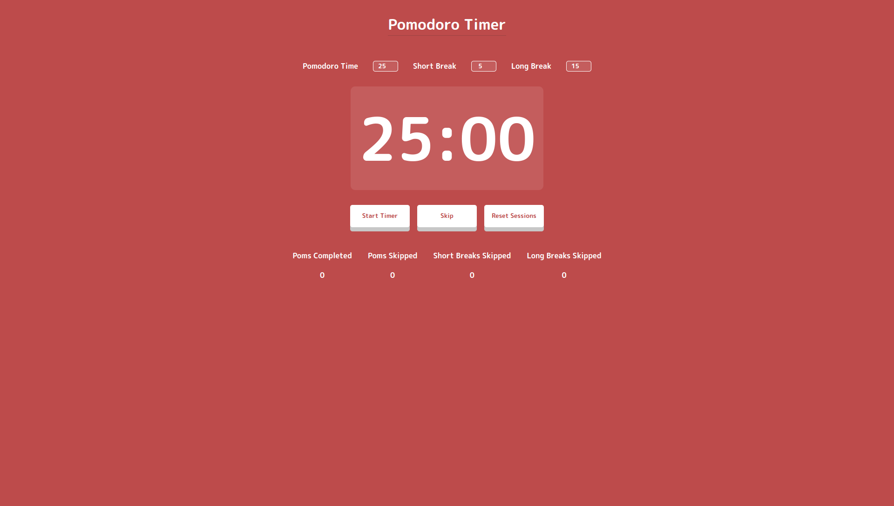

# Pomodoro Timer

A pomodoro timer implemented in vanilla JS and CSS Flexbox.

One full pomodoro cycle is:

1. 25 min pomodoro
2. 5 min short break
3. 25 min pomodoro
4. 5 min short break
5. 25 min pomodoro
6. 5 min short break
7. 25 min pomodoro
8. 15 min long break

`Reset Sessions` button will start your pomodoro cycle over.

